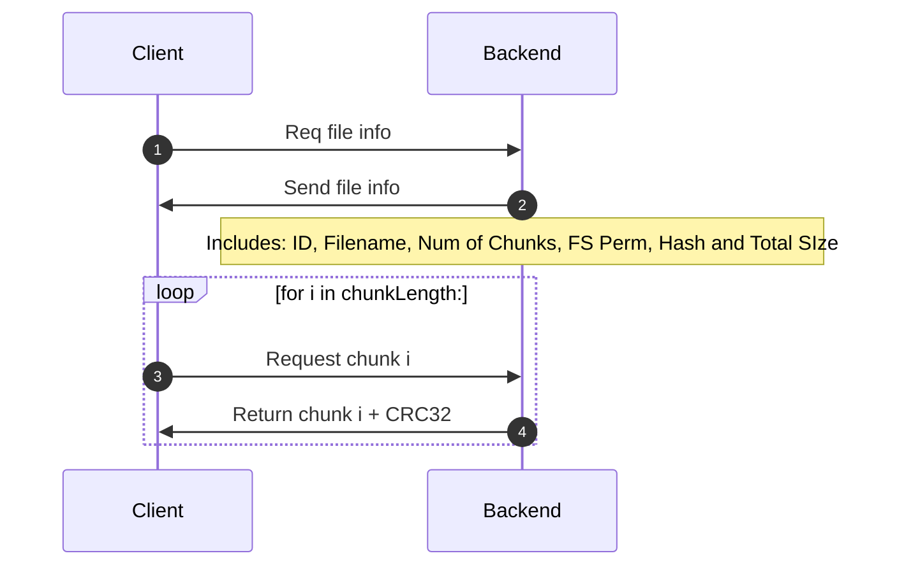

# Files

The process of transferring files from the back-end to the client is described below.

## Upload of files
Files are uploaded to the back-end from the front-end interface. These files are assigned a UUID and are stored in the specified "uploads" folder with the UUID being their name. A DB entry is created to retain the original file details such as name, MD5 hash and size in bytes. 

## Chunking
When a file is requested from the server, the following process occurs:

